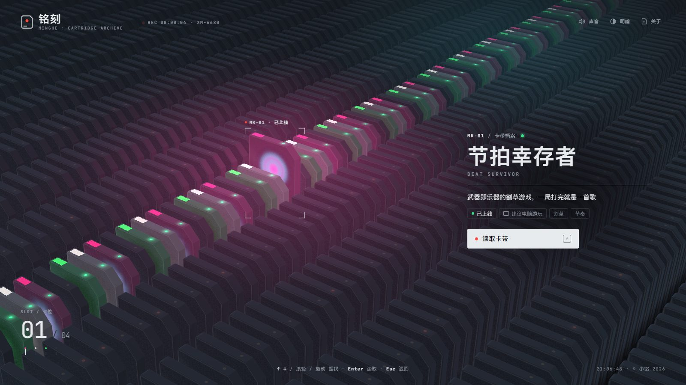
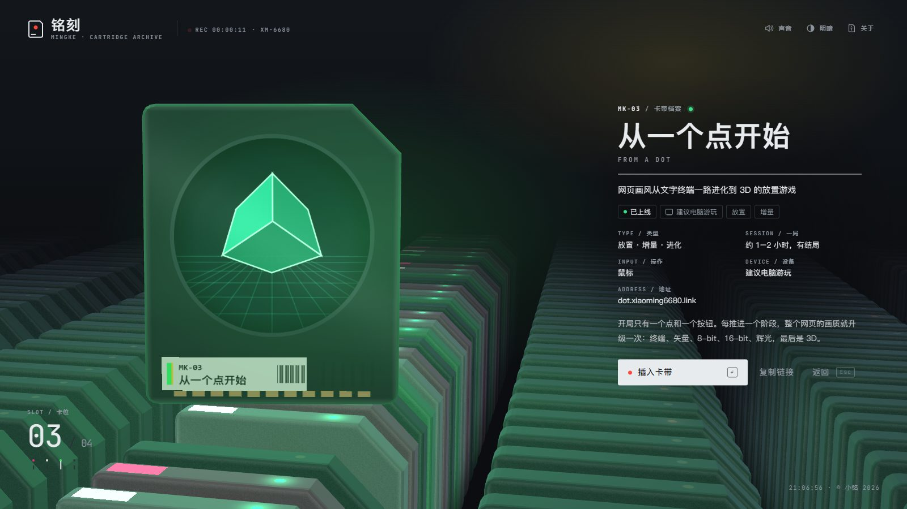
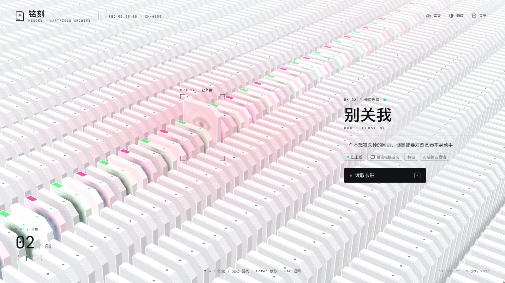
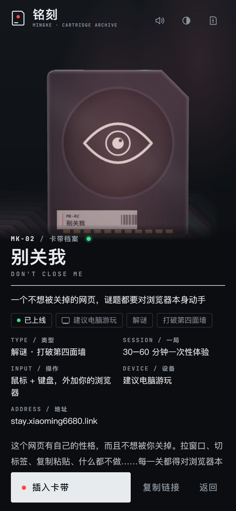

# 铭刻 · 小铭的小游戏卡带库

> 一盒卡带，一个小游戏。翻找、抽出、看磨砂玻璃变清晰，然后插进去玩。

**▶ 打开：<https://play.xiaoming6680.link>** · 电脑、手机都能看（游戏本身建议用电脑玩）

## 这是什么

小铭做的所有网页小游戏的入口。每个游戏都被刻进一盒玻璃卡带，整整齐齐码在一座望不到头的仓库里。翻到想玩的那盒，读取它，再把它插进去，就会进入游戏。

## 卡带里有什么

| 卡带 | 一句话 | 一局 | 直接去玩 |
|---|---|---|---|
| MK-01 节拍幸存者 | 武器即乐器的割草游戏，一局打完就是一首歌 | 约 8 分钟 | <https://beat.xiaoming6680.link> |
| MK-02 别关我 | 一个不想被关掉的网页，谜题都要对浏览器本身动手 | 30–60 分钟 | <https://stay.xiaoming6680.link> |
| MK-03 从一个点开始 | 网页画风从文字终端一路进化到 3D 的放置游戏 | 约 1–2 小时，有结局 | <https://dot.xiaoming6680.link> |

最后还有一盒空白卡带：下一个游戏做好了，会刻进那里。

## 玩起来是这样

| | |
|---|---|
|  |  |
| **读取**：卡带被抽出来，磨砂外壳从上往下变清晰，露出每个游戏自己的"核心"，旁边解密出游戏资料。 | **明暗两套配色**：右上角一键切换，默认跟随系统。 |

手机上也能翻找和读取；游戏是电脑优先的，插入前会提醒你，也可以复制链接发到电脑上。

## 怎么操作

| | 电脑 | 手机 |
|---|---|---|
| 翻找 | `↑` `↓`、滚轮或拖动 | 上下滑 |
| 读取 / 插入 | `Enter`，或点按钮 | 轻点卡带 |
| 返回 | `Esc` | 点「返回」 |

- 第一次打开有一段约 6 秒的开场：轻触开机键会开声音，也可以静音进入；右下角可以跳过。长按左上角标志能重播。
- 玩完游戏按浏览器的返回键，会回到你刚才那盒卡带。
- 仓库里藏着几个彩蛋，慢慢翻。

## 致谢

卡带阵列、抽取与磨砂解密的交互思路借鉴自 [RhineLabUI](https://github.com/LBEILC/RhineLabUI)，部分运动与手势代码改编自其源码（Copyright (c) 2026 LBEILC，MIT）。等宽字体 JetBrains Mono（SIL OFL 1.1）。许可全文在 `public/licenses/`。

---

开发说明（本地运行、构建、加新游戏、站点总表）见 [docs/](docs/开发说明.md)。
