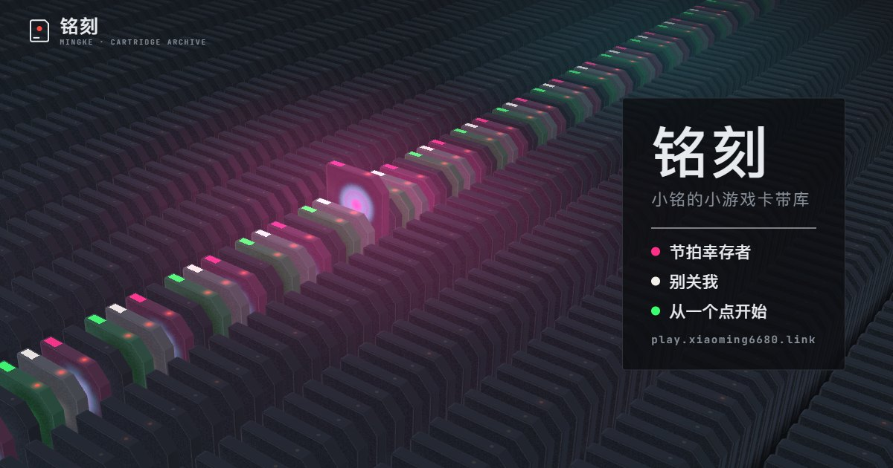

# 铭刻 · 小铭的小游戏卡带库

<https://play.xiaoming6680.link> —— 小铭所有网页小游戏的入口。每个游戏是一盒玻璃卡带：翻找、抽出，看磨砂玻璃变清晰，再插进去开玩。



## 本地查看

```bash
npm install
npm run dev
```

打开 <http://127.0.0.1:5180>。也可以 `npm run build` 之后直接双击 `dist/index.html`。

## 操作

- 第一次打开有一段约 6 秒的开场：先轻触开机键（浏览器要点一下才允许出声），也可以静音进入；右下角可以跳过。长按左上角标志可以重播
- 电脑：`↑` `↓` / 滚轮 / 拖动翻找，`Enter` 读取、插入，`Esc` 返回
- 手机：上下滑翻找，轻点卡带读取

## 加一个新游戏

1. 在 `content/games.json` 的 `games` 里加一项（字段见 [docs/设计.md](docs/设计.md) §15）
2. `npm run build`

游戏上线时，把它的 `status` 改成 `live`。

## 文档

- [docs/设计.md](docs/设计.md)：设计稿
- [docs/开发说明.md](docs/开发说明.md)：结构、构建、自测、性能
- [docs/方案.md](docs/方案.md)：立项方案

## 致谢

卡带阵列、抽取与磨砂解密的交互思路借鉴自 [RhineLabUI](https://github.com/LBEILC/RhineLabUI)，部分运动与手势代码改编自其源码（Copyright (c) 2026 LBEILC，MIT）。等宽字体 JetBrains Mono（SIL OFL 1.1）。许可全文在 `public/licenses/`。
